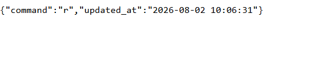

# ESP32-Robot-Control
A simple project that connects an ESP32 with a PHP &amp; MySQL server to receive data and execute commands in real time.

---

## 🛠️ Technologies Used
- ESP32 (Arduino IDE)
- PHP
- MySQL
- HTML / JavaScript

---

## 📝 Project Workflow
1. Database Setup: Created a MySQL database to store commands and system states.
2. Backend Development: Implemented PHP scripts (such as `get_state.php`) on the web server to fetch and output the current state data.
3. ESP32 Programming: Wrote and configured the C++ code in Arduino IDE to connect the ESP32 to Wi-Fi and communicate with the web server.
4. Testing & Live Integration: Uploaded the code to the ESP32 and verified the live connection and data streaming through the Serial Monitor and server response.

---

## 📸 Output

---
## 📂 Source Code

- Web Files: index.html, db.php, get_state.php, update_command.php
- Database: setup.sql
- ESP32 Code: sketch2.ino
